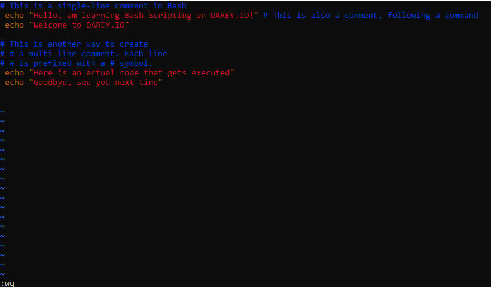
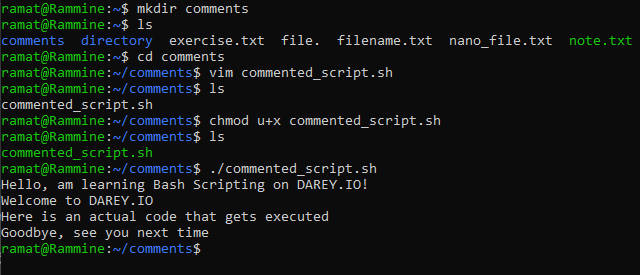
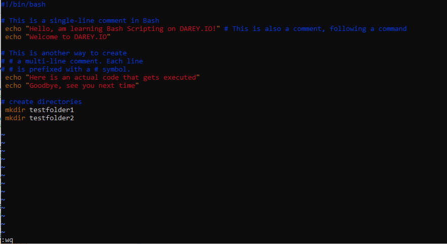
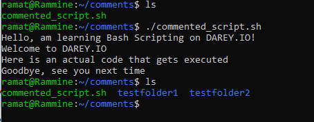

# comment-bash

## comments are essential in programming, it serves as note to the programmer or anyone else who has acess to read the code.

### comment: are line in code that are ignored by interpreter, they are not excuteable in programm.

